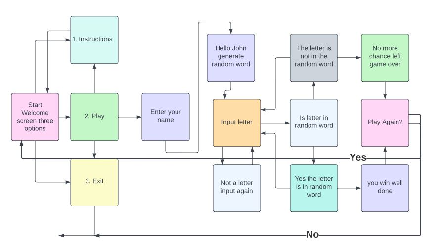

<h1 align="center">Hangman World</h1>
Hangman World is a word guessing game. As the name suggest the words that will be included in this game are taken from places all around the world. It is a python terminal game. The aim of the game is to guess the secret word before all of your guesses run out. 

<h2 align="center">How to play</h2>

If the user selects Play Game they will be asked to enter their name. The user will then be presented with blank spaces which represent the secret word the user has to guess. Each time the user guesses a wrong letter they are one step closer to being hanged which will be represented by the hangman icon at the end of the game. Each time the user guesses a correct letter it will replace the underscore with the correct letter. 

example:
Secret word: CANADA
_ _ _ _ _
user guesses: A
_ A _ A _ A

<h2 align="center"> Features </h2>
The user will be presented with three options at the start of the game.

1. Play Game
2. Instructions
3. Exit

If the user types in the number one they will be asked to type their name. The game will then begin. 

If the user types number 2 the instructions will appear. The user will then make another selection.

If the user types in number 3 the game will exit

### Future Features

Add in an option for users to see the high scores
Add in a list for wrong letters guessed already
Add in a list of countries that have previously been guessed
Add in the hangman pictures everytime a user gets the letter wrong

<h2 align> Flowchart </h2>

