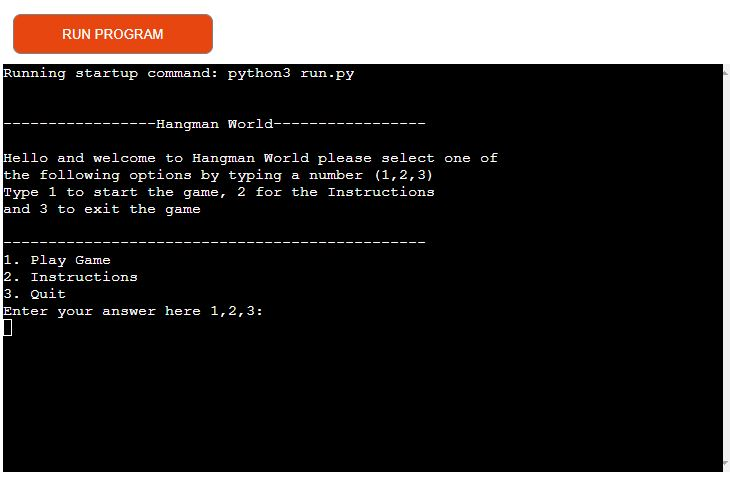
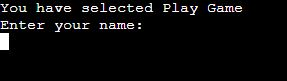
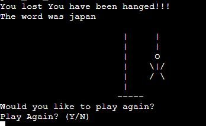
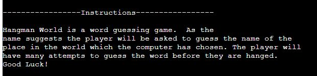

<h1 align="center">Hangman World</h1>
Link to: <a href="https://hangmanworld.herokuapp.com/">Hangman World</a>

Hangman World is a word guessing game. As the name suggest the words that will be included in this game are taken from places all around the world. It is a python terminal game. The aim of the game is to guess the secret word before all of your guesses run out. 

<h2 align="center">How to play</h2>

If the user selects Play Game they will be asked to enter their name. The user will then be presented with blank spaces which represent the secret word the user has to guess. Each time the user guesses a wrong letter they are one step closer to being hanged which will be represented by the hangman icon at the end of the game. Each time the user guesses a correct letter it will replace the underscore with the correct letter. 

example:
Secret word: CANADA
_ _ _ _ _
user guesses: A
_ A _ A _ A

<h2 align="center"> Features </h2>

The user will be presented with three options at the start of the game.

1. Play Game
2. Instructions
3. Exit

If the user types in the number one they will be asked to type their name. The game will then begin. 

The user will then be presented with the secret word. The user will have to guess all of the letters before their lives run out. If they guess the wrong letters they will be hanged. The user will then be asked if they would like to play again.

If the user guesses the word. The computer will display congratulations, The user will then be asked if they would like to play the game again.

If the user types number 2 the instructions will appear. The user will then make another selection.

If the user types in number 3 the game will exit

### Future Features

- Add in an option for users to see the high scores
- Add in a list for wrong letters guessed already
- Add in a list of countries that have previously been guessed
- Add in the hangman pictures everytime a user gets the letter wrong

<h2 align="center"> Flowchart </h2>

<h2 align="center"> Testing </h2>

I have tested my project by doing the following:

- Running my project through Pep8 online and fixing any errors
- Playing my project muliple times to check for errors
- Putting the wrong data into the input field to check if my code is working

<h2 align ="center"> Bugs </h2>
 - You can enter the wrong letter in twice
 - The counter goes down to 0 and tells the user they have less lives than they do

 <h2 align ="center"> Validator Testing </h2>
 
 No errors were found on Pep8 online <a href ="http://pep8online.com/checkresult">Pep8 link</a>
 
<h2 align="center"> Deployment </h2>

- I created an account on Heroku
- I made a new application on Heroku
- I updated the Config Var settings adding Port for the Key and 8000 for the value
- I addded the Python and the Nodejs buildpack.
- I had issues connecting my Github to my heroku account
- I deployed my project on Github using heroku login -i and entering my details
- I pushed my code using git push heroku main

<h2 align="center"> Credits </h2>

- My mentor Spencer Barriball helped me out with some of the code
- I also used some code from Love Sandwiches.

